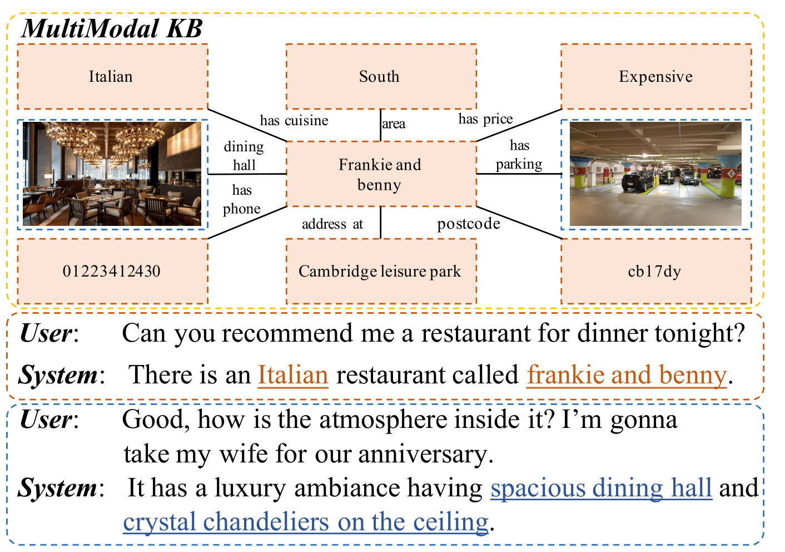
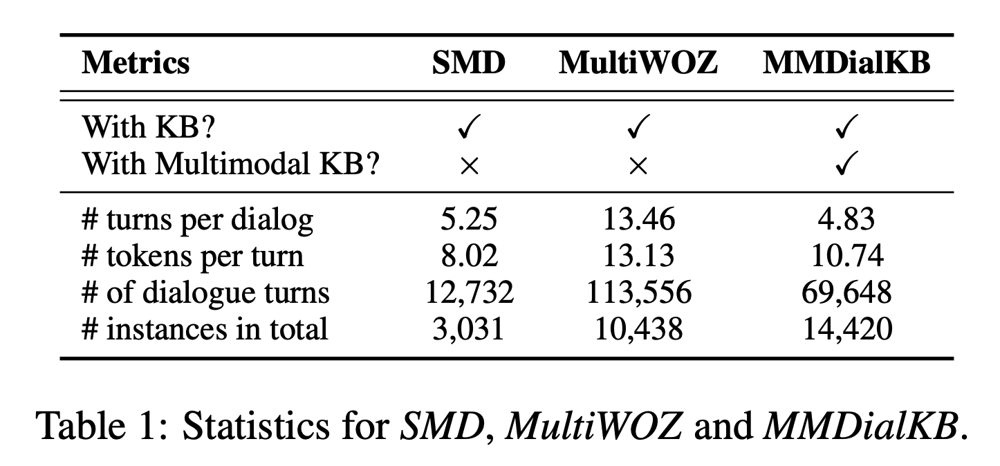

## MMDialKB Benchmark
**MMDialKB** is a benchmark for task-oriented dialogues with multimodal knowledge bases (KBs), i.e., textual and visual knowledge in this paper. This benchmark consists of three parts: dialogue utterances, images and knowledge base. The dialogue utterances are collected through Amazon Mechanical Turk where two workers (one plays the role of user and one plays the role of system) are matched to perform dialogues based on the textual and visual information from the multimodal KBs for restaurant reservation. For the multimodal knowledge base, it contains not only textual but also visual information about KB entities stored in it. The textual part is a subset (i.e., the restaurant domain) of *MultiWOZ [Budzianowski et al., 2018]* dataset. We expand it by adding visual information (i.e., images) for every KB entry (i.e., each restaurant) to support multimodal dialogues. All the images are crawled from mainstream image search engines (i.e., Google image search, Microsoft Bing image search). To ensure the quality of the collected images, we manually clean the data by filtering the low-resolution images, images with watermarks, and incomplete images. More about this benchmark such as the background and how it is generated are described in [*[Shiquan Yang, Rui Zhang, Sarah Erfani, and Jey Han Lau. "UniMF: A Unified Framework to Incorporate Multimodal Knowledge Bases into End-to-End Task-Oriented Dialogue Systems". IJCAI (2021)]*](https://www.ijcai.org/proceedings/2021/0548.pdf).



## Download the dataset [here](https://github.com/shiquanyang/UniMF)

## What are in this Repository
This repository contains the following contents:
```
/
├── MMDialKB/                 --> (The benchmark datasets folder)
|   ├── train/                --> (The train split. It contains all the training dialogues of MMDialKB)
|   ├── dev/                  --> (The development split. It contains all the development dialogues of MMDialKB)
|   ├── test/                 --> (The test split. It contains all the test dialogues of MMDialKB)
|   ├── images/               --> (The image resources. It contains all the images used in MMDialKB)
|   ├── database.json         --> (The database information. It contains all the KB entries used in MMDialKB)
├── LICENCE                   --> (The licence file)
└── README.md                 --> (The readme file)
```

## Notes on the data format in the benchmark
Our dataset is organized in a format similar to the SGD dataset *SGD [Rastogi et al., 2020]*. Each dialogue is represented as a json object with the following fields:
* dialogue_id: A unique identifier for a dialogue.
* services: service presented in the dialogue.
* turns: A list of system or user utterances.
  
Each turn consists of the following fields:
* speaker: The speaker for the turn. Possible values are "USER" or "SYSTEM".
* utterance: A string containing the natural language utterance.
* frames: A list of frames, where each frame contains annotations for a single service.
  
Each frame consists of the following fields:
* service: The name of the service corresponding to the frame.
* slots (optional): A list of slot spans in the utterance.
* actions (optional): A list of actions corresponding to the system.
* service_call (system turns only, optional): The request sent to the service.
* service_results (system turns only, optional): A list of entities containing the results obtained from the service. It is only available for turns in which a service call is made. Each entity is represented as a dictionary mapping a slot name to a string containing its canonical value.
* state (user turns only, optional): The dialogue state corresponding to the service.


## Dataset Statistics



## Citation
If you use the datasets in the MMDialKB Benchmark, please credit us by citing the following papers:

* [Yang et al. 2021] *Shiquan Yang, Rui Zhang, Sarah Erfani, and Jey Han Lau. "UniMF: A Unified Framework to Incorporate Multimodal Knowledge Bases into End-to-End Task-Oriented Dialogue Systems". IJCAI (2021).*

```
@inproceedings{ijcai2021-548,
  title     = {UniMF: A Unified Framework to Incorporate Multimodal Knowledge Bases intoEnd-to-End Task-Oriented Dialogue Systems},
  author    = {Yang, Shiquan and Zhang, Rui and Erfani, Sarah M. and Lau, Jey Han},
  booktitle = {Proceedings of the Thirtieth International Joint Conference on
               Artificial Intelligence, {IJCAI-21}},
  publisher = {International Joint Conferences on Artificial Intelligence Organization},
  editor    = {Zhi-Hua Zhou},
  pages     = {3978--3984},
  year      = {2021},
  month     = {8},
  note      = {Main Track}
  doi       = {10.24963/ijcai.2021/548},
  url       = {https://doi.org/10.24963/ijcai.2021/548},
}

```
